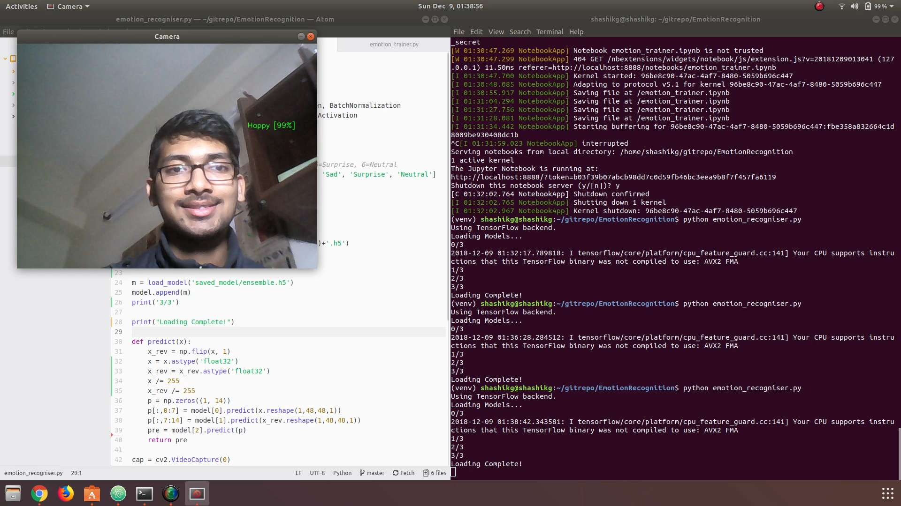
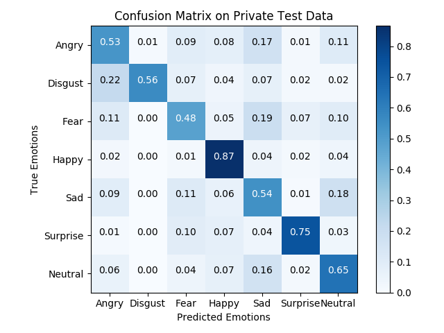

# Real Time Human Emotion Recognition
This repo contains files related to my project on emotion recognition carried during the end of my 5th semester as a hobby project. Presently, its capable of extracting faces from a web cam stream and classify them into 7 different moods i.e. Angry, Disgust, Fear, Happy, Sad, Surprise and Neutral. The face detection module uses already trained Haar-Cascade/ dnn based face detector from OpenCV. And Classifier was trained on the **ICML 2013** dataset of [Facial Expression Recognition Challenge](https://www.kaggle.com/c/challenges-in-representation-learning-facial-expression-recognition-challenge) on kaggle.

<p align="center">

**Link to Demo Video:** [https://youtu.be/XVQSMbeBGZQ](https://youtu.be/XVQSMbeBGZQ)

## Training Results
**Accuracy Achieved on Test Data:** 65.34 %
<!-- **Confusion Matrix:** -->
<p align="center"></p>

## Proposed Neural Network Architecture
<p align="center"></p>

## Usage
Download the **Dataset** from [here](https://www.kaggle.com/c/challenges-in-representation-learning-facial-expression-recognition-challenge) and put **fer2013.csv** inside the data folder. Then install all the dependencies in a virtual environment
```
$ virtualenv --system-site-packages -p python3 ./venv
$ source ./venv/bin/activate
$ pip install -r requirements.txt
```
Then run the following commands to test the module
```
# To train a new model
$ python emotion_trainer.py

# To run the emotion recognition module
$ python emotion_recogniser.py
```
### Selecting face-detector
In **emotion_recogniser.py** change the following line as per your choice:
```
# for dnn based use this
faces = get_faces(img, method='dnn')
```
```
# for haar-cascade based use this
faces = get_faces(img, method='haar')
```

## Directory Structure
```
├── saved_model
│   └── cnn0.h5 ..................................:: Trained CNN model
│   └── cnn1.h5 ..................................:: Trained CNN model on mirror images
│   └── ensemble.h5 ..............................:: Trained NN Model on prediction from above two
│   └── haarcascade_frontalface_default.xml ......:: OpenCV Haar-Cascade model for frontfaces
│   └── opencv_face_detector_uint8.pb ............:: OpenCV trained model for faces
│   └── haarcascade_frontalface_default.xml ......:: OpenCV trained model for faces
├── detectfaces.py ...............................:: Contains function to call face detector and
│                                                    crop & resize the detected faces to 48x48 size
├── emotion_trainer(.py/ .ipynb) .................:: This will train the designed Neural Network model on the given dataset
├── emotion_recogniser.py ........................:: This is the main program which will show real-time emotion classification
│                                                    using the models saved in the directory 'saved_model/'
├── plot_confusion_matrix.py .....................:: Used to generate the confusion matrix of the trained model
├── img/ .........................................:: Contains some images related to results and for testing
├── requirements.txt
└── README.md
```
